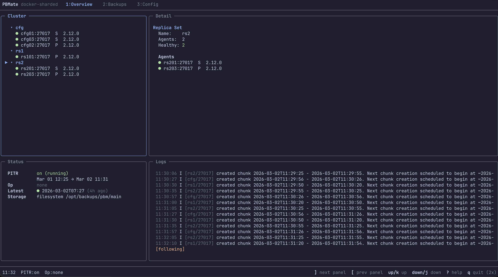
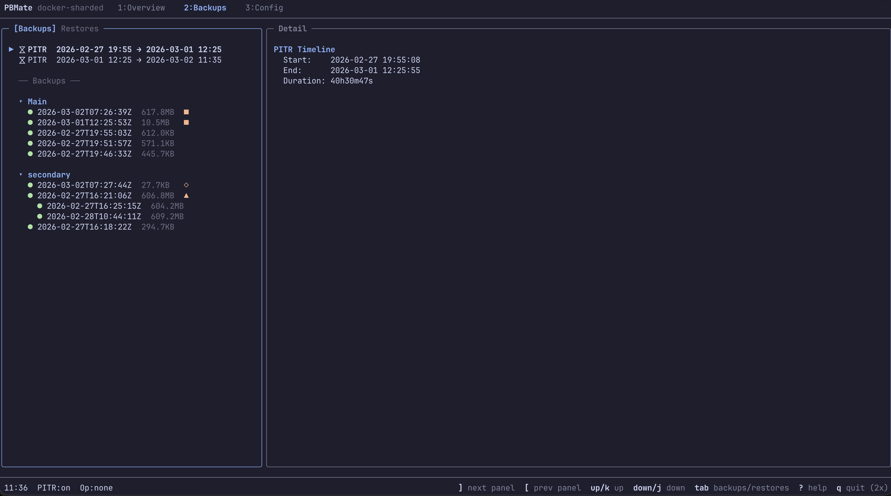
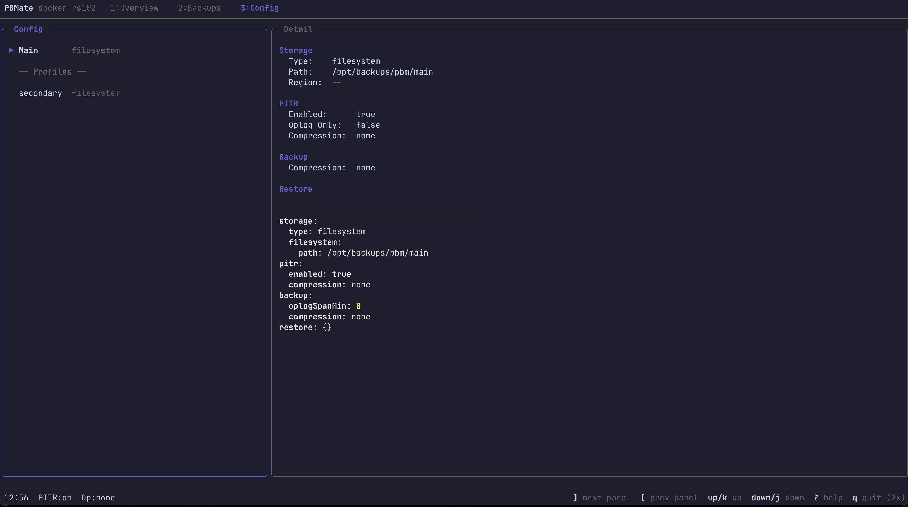
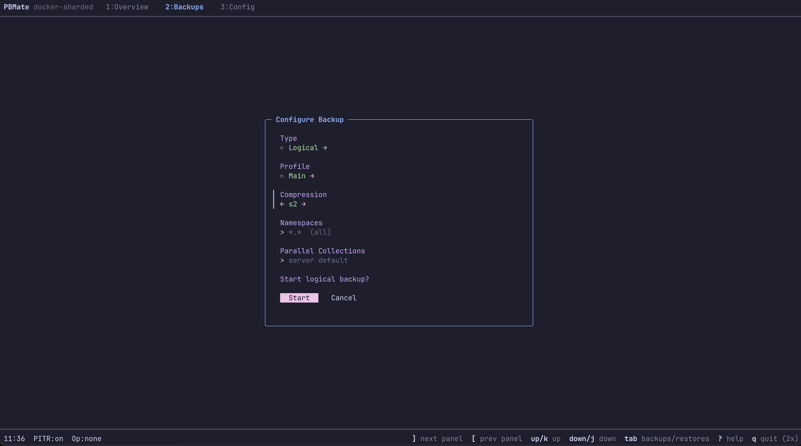
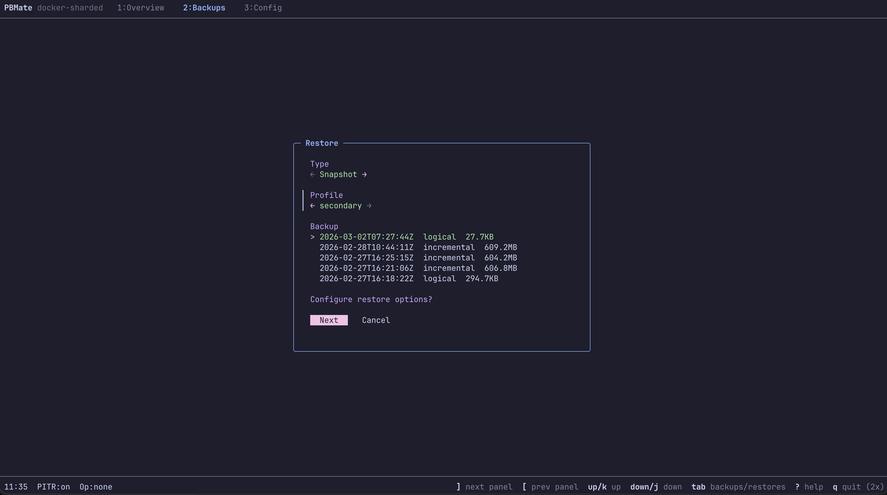
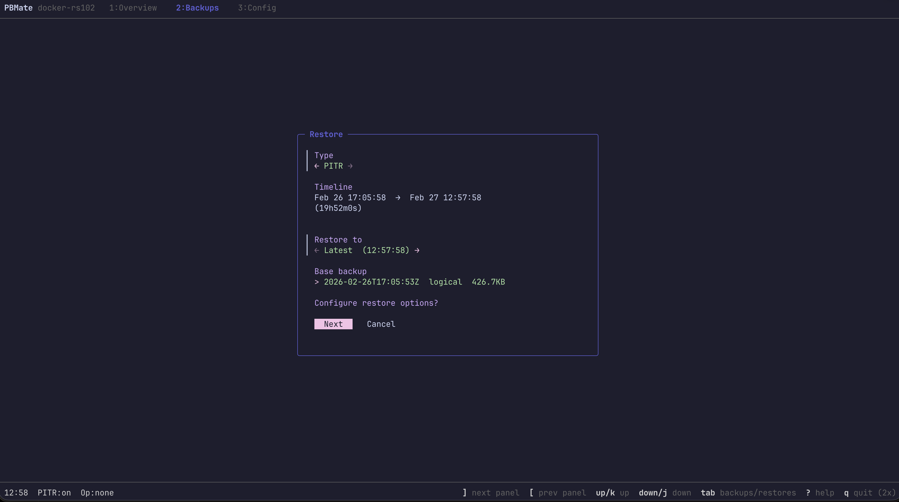

<p align="center">
  <h1 align="center">PBMate</h1>
  <p align="center">A terminal UI and Go SDK for <a href="https://github.com/percona/percona-backup-mongodb">Percona Backup for MongoDB</a></p>
</p>

<p align="center">
  <a href="https://github.com/jcechace/pbmate/releases"></a>
  <a href="https://github.com/jcechace/pbmate/actions/workflows/ci.yml"></a>
  <a href="LICENSE"></a>
  <a href="https://pkg.go.dev/github.com/jcechace/pbmate/sdk/v2"></a>
</p>

<p align="center">
  
</p>

---

**PBMate** gives you a real-time terminal dashboard for monitoring and managing PBM clusters, plus a standalone Go SDK for building your own tooling.

> A personal project by [Jakub Cechacek](https://github.com/jcechace), member of the PBM development team at Percona. Not an official Percona product.

## Features

**Monitor** — Cluster topology, agent health, PITR status, running operations, and live-streamed logs in a single view.

**Operate** — Start backups (logical, physical, incremental), restore snapshots or to a point in time, manage storage profiles, toggle PITR, and bulk-delete old data — all through guided forms.

**Configure** — View and edit PBM configuration with syntax-highlighted YAML, manage storage profiles, and resync agents.

**Stay safe** — Physical restore warnings before mongod shutdown, confirmation dialogs for destructive actions, readonly mode for production dashboards.



<details>
<summary>More screenshots</summary>

### Backups



### Config



### Backup Form



### Restore Wizard



### Point-in-Time Restore



</details>

## Installation

### Homebrew

```bash
brew tap jcechace/tap
brew install pbmate
```

### Binary Download

Grab a pre-built binary from [GitHub Releases](https://github.com/jcechace/pbmate/releases).

### From Source

```bash
go install github.com/jcechace/pbmate@latest
```

## Documentation

| Guide | Audience |
|-------|----------|
| [Usage Guide](docs/usage.md) | TUI walkthrough — backups, restores, config, monitoring |
| [Configuration](docs/configuration.md) | Config file, contexts, themes, editor, readonly mode |
| [Troubleshooting](docs/troubleshooting.md) | Connection issues, PBM compatibility, common errors |
| [SDK Reference](sdk/README.md) | Go SDK for programmatic PBM access |

## Quick Start

```bash
# Connect directly
pbmate --uri mongodb://localhost:27017

# Or save a named context and reuse it
pbmate context add dev --uri mongodb://localhost:27017
pbmate context use dev
pbmate
```

Press `?` inside the TUI to see all available keybindings.

## What You Can Do

| Action | Key | Description |
|---|---|---|
| Start backup | `s` / `S` | Quick (one key) or fully configured (type, profile, compression, namespaces) |
| Restore | `r` / `R` | From selected backup, or wizard with snapshot/PITR picker |
| Cancel backup | `X` | Cancel a running backup |
| Delete | `d` | Delete selected backup or storage profile |
| Bulk delete | `D` | Delete backups or PITR chunks older than a threshold |
| Toggle PITR | `p` | Enable or disable point-in-time recovery |
| Set config | `C` / `c` | Upload YAML config to main or a named profile |
| Resync | `R` / `r` | Resync agents (on Config tab) |
| Filter logs | `l` | Filter by severity, replica set, or event type |
| Follow logs | `f` | Stream logs in real time |
| Edit config | `e` | Open config in external editor (Config tab) |
| Help | `?` | Show all keybindings |

See the [Usage Guide](docs/usage.md) for detailed workflows and the [full keybinding reference](docs/usage.md#keybinding-reference).

## CLI

```bash
pbmate                                     # launch TUI (current context)
pbmate --uri <uri> --theme mocha           # explicit connection + theme
pbmate --readonly                          # monitoring only, no mutations

pbmate context list                        # show saved contexts
pbmate context add prod --uri <uri>        # save a connection
pbmate context use prod                    # switch active context

pbmate config show                         # print config as YAML
pbmate config set theme mocha              # global setting
pbmate config set readonly true --context=prod  # per-context override
```

See [Configuration](docs/configuration.md) for the full config file reference, CLI flags, and context management.

## SDK

PBMate includes a standalone Go SDK for programmatic access to PBM. It wraps PBM internals behind stable, domain-typed interfaces — your code won't break when PBM changes.

```go
import sdk "github.com/jcechace/pbmate/sdk/v2"

client, err := sdk.NewClient(ctx, sdk.WithMongoURI("mongodb://localhost:27017"))
defer client.Close(ctx)

// Start a backup and wait for it.
result, _ := client.Backups.Start(ctx, sdk.StartLogicalBackup{})
bk, _ := result.Wait(ctx, sdk.BackupWaitOptions{})
fmt.Printf("backup %s: %s\n", bk.Name, bk.Status)

// Point-in-time restore.
res, _ := client.Restores.Start(ctx, sdk.StartPITRRestore{
    BackupName: "2026-02-19T20:28:16Z",
    Target:     sdk.Timestamp{T: 1740000000},
})
```

See the [SDK README](sdk/README.md) for full API docs, examples, and design details.

## Building

```bash
task build    # build all modules
task check    # build + vet + lint + test
```

Requires Go 1.26+. Running the TUI requires a PBM-configured MongoDB cluster. Integration tests only require Docker (they use testcontainers).

## Project Structure

Monorepo with three Go modules:

- **`sdk/`** — Standalone Go SDK (`github.com/jcechace/pbmate/sdk/v2`)
- **`internal/tui/`** — Terminal UI (BubbleTea)
- **`mcp/`** — MCP server (planned)

## License

[Apache-2.0](LICENSE)
